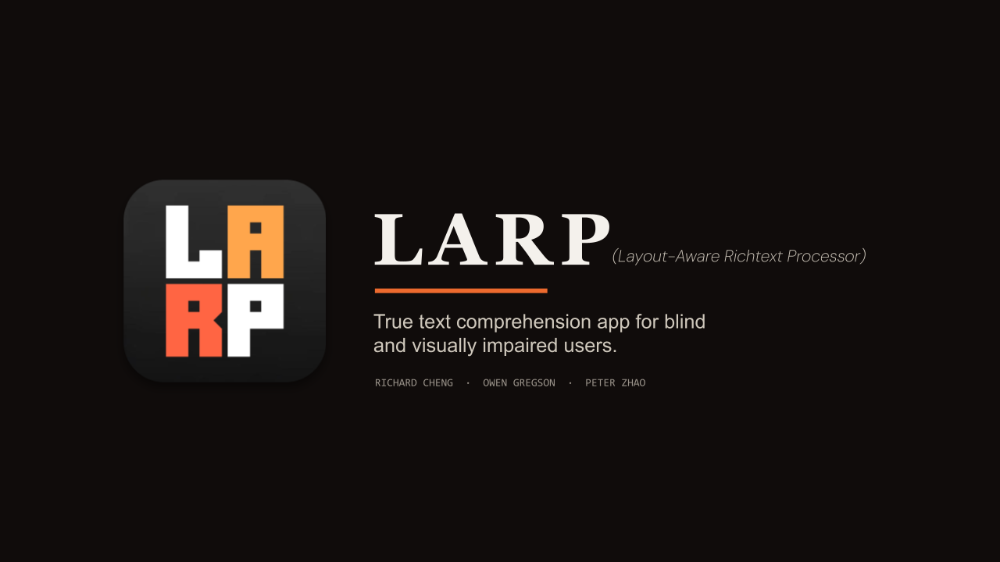
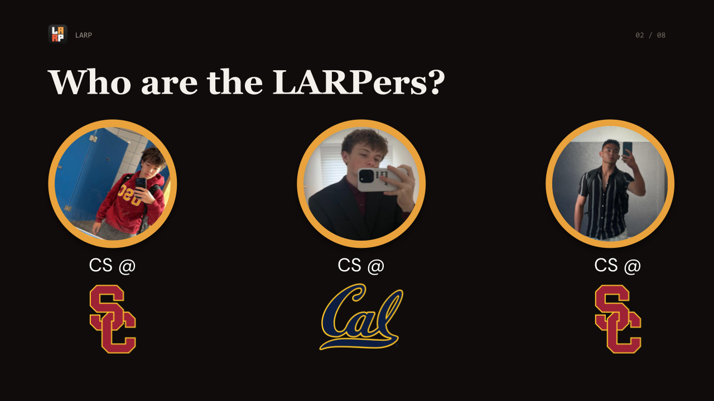
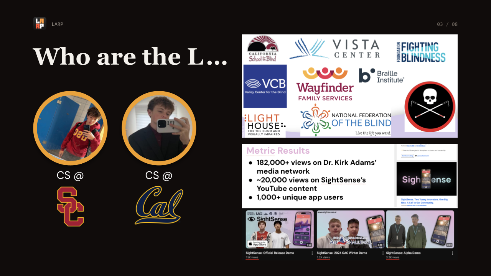
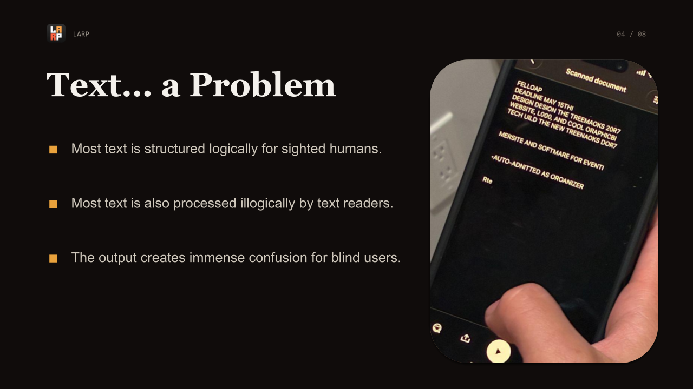
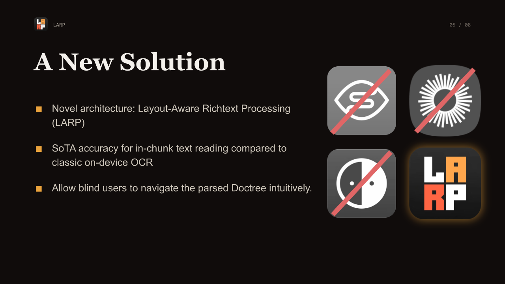
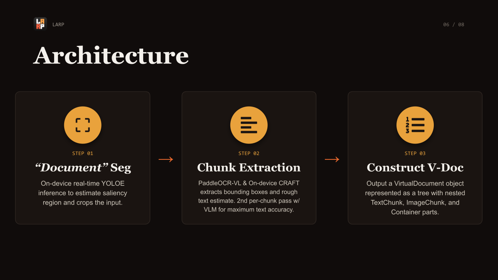
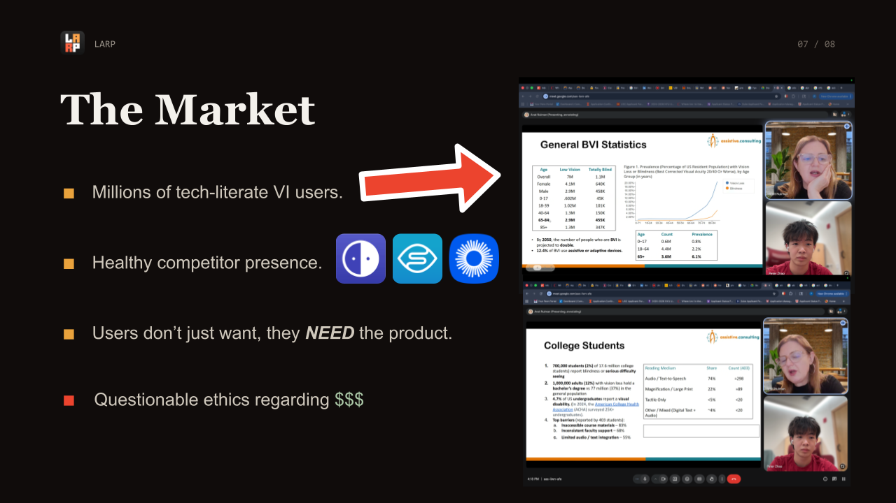
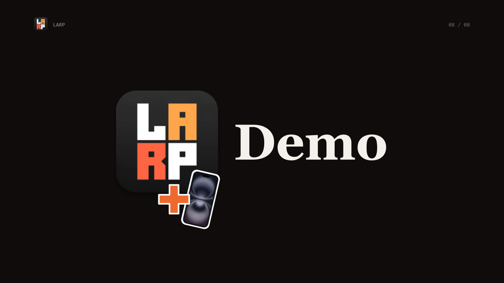
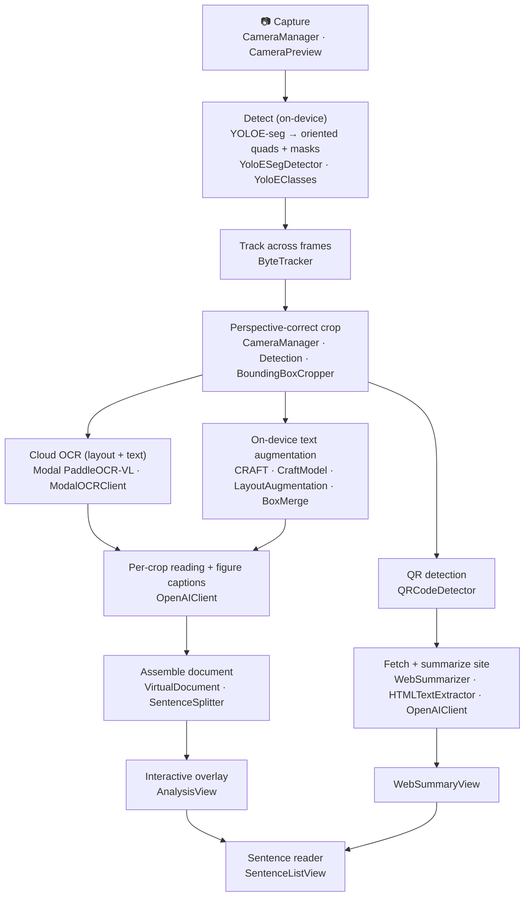

# LARP — AlphaG3n

> A camera-first, **layout-aware document scanner** for iOS. Point it at a printed
> page; it detects the document, deskews it, reads the text with cloud + on-device
> OCR, and shows you an interactive, accessibility-first overlay you can drill into
> sentence by sentence — and summarize any QR-linked website out loud.

LARP (Xcode target **AlphaG3n**) is a SwiftUI app built for iOS 26. It combines
on-device Core ML (object/text detection) with cloud OCR and vision-language
models to turn a single photo of a page into structured, navigable, spoken-friendly
content. VoiceOver support is a first-class concern throughout.

---

## Table of contents

- [What it does](#what-it-does)
- [Presentation](#presentation)
- [How it works](#how-it-works)
  - [Pipeline overview](#pipeline-overview)
  - [Stage-by-stage](#stage-by-stage)
- [Project structure](#project-structure)
- [Requirements](#requirements)
- [Setup & build](#setup--build)
  - [1. Secrets](#1-secrets)
  - [2. Core ML models](#2-core-ml-models)
  - [3. Build & run](#3-build--run)
- [Configuration reference](#configuration-reference)
- [Developer scripts](#developer-scripts)
- [Accessibility](#accessibility)
- [Notes & limitations](#notes--limitations)

---

## What it does

1. **Scan** — Open the camera, hold steady over a page, and tap the shutter. A live
   on-device detector highlights the document and the app auto-crops + deskews to
   the page you're pointing at.
2. **Read** — The captured page is sent to a self-hosted PaddleOCR-VL OCR endpoint,
   which returns a structured layout (titles, paragraphs, headers, figures, …).
   Individual text regions are transcribed with an OpenAI vision pass, and an
   on-device CRAFT detector augments any text the layout model missed.
3. **Explore** — Results are drawn back onto the photo as color-coded, tappable
   regions. Tap a text block to read it one sentence per card; tap a QR code to
   fetch, extract, and summarize the linked website — formatted for VoiceOver.

---

## Presentation

A walkthrough of the project. 📥 **[Download the full deck (`Presentation.pptx`)](Presentation.pptx)**

<table>
  <tr>
    <td width="50%"></td>
    <td width="50%"></td>
  </tr>
  <tr>
    <td width="50%"></td>
    <td width="50%"></td>
  </tr>
  <tr>
    <td width="50%"></td>
    <td width="50%"></td>
  </tr>
  <tr>
    <td width="50%"></td>
    <td width="50%"></td>
  </tr>
</table>

---

## How it works

### Pipeline overview



### Stage-by-stage

| Stage | Owner file(s) | What happens |
|-------|---------------|--------------|
| **Capture** | `CameraManager`, `CameraPreview` | Owns the `AVCaptureSession`, manages device orientation, streams live frames to the detector, and on shutter freezes the preview and produces an upright JPEG. |
| **Detect** | `YoloESegDetector`, `YoloEClasses`, `Detection` | Runs a YOLOE segmentation model. Reconstructs per-instance masks, extracts an oriented quad (not just an axis-aligned box) per object, and maps it back to image coordinates. |
| **Track** | `ByteTracker` | Two-stage IoU association keeps stable object IDs across frames and smooths boxes, so the live highlight doesn't jitter. |
| **Crop / deskew** | `CameraManager`, `BoundingBoxCropper` | Uses the detected quad with `CIPerspectiveCorrection` to warp the page upright before upload; crops individual layout regions with per-class padding. |
| **Cloud OCR** | `ModalOCRClient` | Posts the page to a self-hosted **PaddleOCR-VL** deployment on [Modal](https://modal.com) and decodes a structured layout (block label, content, bbox, polygon). This is the OCR client the live capture path uses. |
| **Text augmentation** | `CraftModel`, `LayoutAugmentation`, `BoxMerge` | An on-device **CRAFT** model finds text regions the layout pass missed; results are merged into the layout. |
| **Per-crop reading** | `OpenAIClient` | Reads each text crop concurrently through the OpenAI Responses API and captions figure regions. Skipped silently if no OpenAI key is configured (boxes still render). |
| **Assemble** | `VirtualDocument`, `SentenceSplitter` | Builds a `VirtualDocument` (image + page size + typed layout parts) and splits block text into sentences with `NaturalLanguage`. |
| **Present** | `AnalysisView`, `SentenceListView`, `LarpTheme` | Draws color-coded quads over the photo, staggers their reveal, and routes taps into a per-block sentence reader. |
| **QR → web** | `QRCodeDetector`, `WebSummarizer`, `HTMLTextExtractor`, `WebSummaryView` | Detects http(s) QR codes on-device; on tap, fetches the page, strips it to plaintext, and summarizes it via OpenAI for a read-aloud-friendly summary. |

**Additional clients in the codebase:** `PaddleOCRModel` (Baidu PaddleOCR cloud API)
and `JinaSegmenterModel` (Jina) are alternate OCR/segmentation clients wired to the
`PADDLE_API_KEY` / `JINA_API_KEY` secrets. The primary capture flow uses the Modal +
OpenAI path above.

---

## Project structure

```
LARP/
├── AlphaG3n.xcodeproj/          # Xcode project (synchronized file groups)
├── AlphaG3n/
│   ├── AlphaG3nApp.swift        # @main entry — WindowGroup → ContentView
│   ├── ContentView.swift        # Top-level state machine: home / processing / result / error
│   ├── HomeView.swift           # Landing screen (starfield, hero logo, entry animation)
│   ├── AnalysisView.swift       # Result overlay: tappable, color-coded detection quads
│   ├── SentenceListView.swift   # Shared sentence-by-sentence reader
│   ├── WebSummaryView.swift     # QR-linked website summary screen
│   ├── LarpTheme.swift          # Design tokens + reusable UI chrome + a11y helpers
│   │
│   ├── CameraManager.swift      # Capture session + pipeline orchestration
│   ├── CameraPreview.swift      # SwiftUI wrapper over the AVCapture preview layer
│   │
│   ├── YoloESegDetector.swift   # YOLOE segmentation inference + quad extraction
│   ├── YoloEClasses.swift       # Class id → name + per-class crop padding
│   ├── ByteTracker.swift        # Multi-object tracking
│   ├── Detection.swift          # Detection / Quad geometry types
│   ├── CraftModel.swift         # On-device CRAFT text detection
│   ├── BoundingBoxCropper.swift # Crops layout regions with margin
│   ├── BoxMerge.swift           # Bounding-box merge helpers
│   ├── LayoutAugmentation.swift # Merge CRAFT boxes into the OCR layout
│   ├── QRCodeDetector.swift     # Vision QR detection (http/https only)
│   │
│   ├── ModalOCRClient.swift     # Self-hosted PaddleOCR-VL (Modal) client  ← primary OCR
│   ├── OpenAIClient.swift       # OpenAI vision reading + figure captions + summaries
│   ├── PaddleOCRModel.swift     # Baidu PaddleOCR cloud client (alternate)
│   ├── JinaSegmenterModel.swift # Jina segmenter client (alternate)
│   │
│   ├── VirtualDocument.swift    # Structured page model (image + typed parts)
│   ├── SentenceSplitter.swift   # NaturalLanguage sentence tokenization
│   ├── HTMLTextExtractor.swift  # HTML → plaintext
│   ├── WebSummarizer.swift      # Fetch + extract + summarize a URL
│   │
│   ├── Secrets.swift            # Reads API keys from Info.plist (build-time injected)
│   ├── secrets.example.xcconfig # Template — copy to secrets.xcconfig (gitignored)
│   ├── Info.plist               # Secret placeholders + bundle config
│   ├── Assets.xcassets/         # App icon, logo, accent color
│   └── run_*.swift              # Standalone dev/test harnesses (excluded from app target)
├── .swiftformat                 # Formatting configuration
└── .gitignore
```

---

## Requirements

- **Xcode** with the **iOS 26 SDK** (deployment target 26.0; portrait only).
- A physical iOS device (the camera pipeline needs real hardware).
- The two **Core ML model files** (see [below](#2-core-ml-models)) — not committed.
- API access for the cloud features:
  - A **Modal PaddleOCR-VL** endpoint (required for the OCR path).
  - An **OpenAI** API key (per-crop text reading, figure captions, web summaries).

---

## Setup & build

### 1. Secrets

API keys are injected at build time via an xcconfig that is **gitignored** — no
secrets live in the repo. Copy the template and fill it in:

```bash
cp AlphaG3n/secrets.example.xcconfig AlphaG3n/secrets.xcconfig
```

Edit `AlphaG3n/secrets.xcconfig`:

```ini
# Modal PaddleOCR-VL endpoint — HOST ONLY, without the https:// scheme
# (xcconfig treats // as a comment, so the scheme is prepended in code).
MODAL_OCR_URL   = your-workspace--paddleocr-vl-pipeline-parse.modal.run
MODAL_OCR_TOKEN =                       # optional bearer token; blank = unauthenticated

OPENAI_API_KEY  = sk-...                # per-crop reading, captions, web summaries

JINA_API_KEY    = jina_...              # optional (alternate segmenter)
PADDLE_API_KEY  = your-paddle-key       # optional (alternate Baidu OCR)
```

These flow `secrets.xcconfig → Info.plist (as `$(VAR)`) → Bundle.main` and are read
at runtime by `Secrets.swift`, which returns `nil` for any key that's missing, empty,
or still an unresolved `$(VAR)` placeholder.

> **Wire it up in Xcode:** Project → **Info → Configurations** → set
> `secrets.xcconfig` as the base configuration for the AlphaG3n target (Debug and
> Release), if it isn't already.

### 2. Core ML models

The models are large binaries and are **not in the repo** (see `.gitignore`). Add
both to the `AlphaG3n` target so they end up in the app bundle:

| Resource name | Bundle file | Role | Loaded by |
|---------------|-------------|------|-----------|
| `yoloe-26x-seg` | `yoloe-26x-seg.mlpackage` → `.mlmodelc` | Layout / object segmentation | `YoloESegDetector` |
| `CRAFT` | `CRAFT.mlpackage` → `.mlmodelc` | Text-region detection | `CraftModel` |

Drag each `.mlpackage` into `AlphaG3n/` in Xcode and confirm **Target Membership →
AlphaG3n**. Xcode compiles them to `.mlmodelc` at build time. The app degrades
gracefully if a model is missing (it logs and skips that stage), but the live scan
experience needs YOLOE present.

### 3. Build & run

1. Open `AlphaG3n.xcodeproj` in Xcode.
2. Select the **AlphaG3n** scheme and a connected iOS device.
3. Build & run (`⌘R`). Grant the camera permission when prompted — the prompt text
   comes from `INFOPLIST_KEY_NSCameraUsageDescription`.

> **Note:** This repo currently builds in Xcode only. There is no Swift Package
> Manager / CocoaPods dependency graph to resolve — everything is first-party Apple
> frameworks (SwiftUI, AVFoundation, Vision, Core ML, Core Image, NaturalLanguage).

---

## Configuration reference

| Secret | Required for | Behavior when missing |
|--------|--------------|-----------------------|
| `MODAL_OCR_URL` | The OCR path (primary) | Capture fails with a prompt to set the endpoint. |
| `MODAL_OCR_TOKEN` | Auth on the Modal endpoint | Endpoint is called unauthenticated. |
| `OPENAI_API_KEY` | Per-crop text reading, figure captions, web summaries | Per-crop reading is skipped silently (boxes still render); web summary reports "not configured". |
| `JINA_API_KEY` | Alternate Jina segmenter | Feature unavailable. |
| `PADDLE_API_KEY` | Alternate Baidu PaddleOCR | Feature unavailable. |

---

## Developer scripts

The `run_*.swift` files are **excluded from the app target** — they're small,
self-contained command-line harnesses for iterating on individual pipeline pieces
without rebuilding the whole app. Compile a script together with the source file(s)
it exercises, e.g.:

```bash
cd AlphaG3n
swiftc BoxMerge.swift run_box_merge.swift -o /tmp/box_merge && /tmp/box_merge
```

| Script | Exercises |
|--------|-----------|
| `run_box_merge.swift` | `BoxMerge` bounding-box merge logic |
| `run_craft.swift` | CRAFT text detection on an image (UIKit-free) |
| `run_crop_geometry.swift` | Perspective-correction corner/upright-axis math |
| `run_qr_geometry.swift` | QR → page-coordinate mapping + URL parsing |
| `run_sentence_split.swift` | `NaturalLanguage` sentence splitting |
| `run_html_extract.swift` | HTML → plaintext extraction |
| `run_openai_batch.swift` | Batch OpenAI vision calls (needs an OpenAI key) |

---

## Accessibility

Accessibility is designed in, not bolted on:

- Every interactive region exposes VoiceOver labels, hints, and traits.
- Detected text and web summaries are presented **one sentence per card** for
  comfortable reading and listening.
- Perpetual animations (hero pulse, scan sweep, staggered box reveal) are gated on
  **Reduce Motion** *and* VoiceOver so they don't churn the view tree or steal focus.
- Backdrop photos are made inert to both touch and VoiceOver so focus lands on
  content first.

---

## Notes & limitations

- **iOS 26 / device required.** The project targets a current-generation SDK and the
  capture pipeline needs real camera hardware; it won't run meaningfully in the
  Simulator.
- **Cloud dependencies.** The OCR path requires a reachable Modal PaddleOCR-VL
  endpoint; reading/summarization requires OpenAI. Both are configured via
  `secrets.xcconfig` and never committed.
- **Models are external.** The `.mlpackage` files are intentionally kept out of
  source control; obtain them from your model-export pipeline and add them to the
  target.

---

## Code style

Swift is formatted with [SwiftFormat](https://github.com/nicklockwood/SwiftFormat)
using the checked-in `.swiftformat` config:

```bash
brew install swiftformat   # once
swiftformat .              # format the whole tree
swiftformat . --lint       # CI check — non-zero exit if anything is unformatted
```
